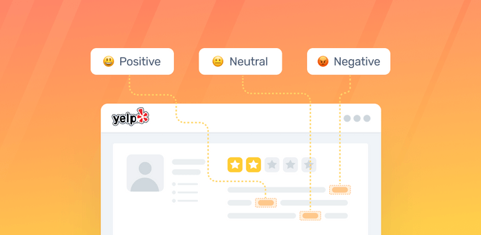

# Yelp RealTime Sentiment Analysis Streaming

<p align="center">

</p>

This project focuses on real-time sentiment analysis of Yelp reviews streaming data. It provide insights into the sentiments expressed by users in their reviews of various businesses listed on Yelp. The project employs advanced data engineering techniques and tools to extract, process, analyze, and visualize the sentiment data in real-time.

By performing real-time sentiment analysis on Yelp reviews, this project aims to assist businesses in understanding customer feedback, identifying trends, and making data-driven decisions to enhance customer satisfaction and improve overall business performance.

Furthermore, the project serves as a comprehensive resource for constructing an end-to-end data engineering pipeline employing TCP/IP Socket, Apache Spark, OpenAI LLM, Kafka, and Elasticsearch. It encompasses every stage of the process, including data acquisition, processing, sentiment analysis utilizing ChatGPT, production to Kafka topic, and establishment of connections to Elasticsearch.

The key components covered in this project include:

- Establishing a data pipeline utilizing TCP/IP.
- Facilitating real-time data streaming via Apache Kafka.
- Employing data processing techniques with Apache Spark.
- Conducting real-time sentiment analysis utilizing OpenAI ChatGPT.
- Synchronizing data from Kafka to Elasticsearch.
- Indexing and querying data within Elasticsearch.

## Table of Content

- [Overview](#overview)
- [Architecture](#architecture)
- [Technologies](#technologies)
- [API Data Description](#api-data-description)
- [Prerequisite](#prerequisites)
- [Usage](#usage)
- [Improvements](#improvements)
- [License](#license)

## Overview

The project is designed with the following components:

- **Data Source:** We use yelp.com dataset for our pipeline.
- **TCP/IP Socket:** Used to stream data over the network in chunks
- **Apache Spark:** For data processing with its master and worker nodes.
- **Confluent Kafka:** Our cluster on the cloud
- **Control Center and Schema Registry:** Helps in monitoring and schema management of our Kafka streams.
- **Kafka Connect:** For connecting to elasticsearch
- **Elasticsearch:** For indexing and querying

## Architecture

<p align="center">

</p>

## Technologies

- Python
- TCP/IP
- Confluent Kafka
- Apache Spark
- openai api
- Docker
- Elasticsearch

## API Data Description

| Column           | Description                                      |
|------------------|--------------------------------------------------|
| `review_id`        | Unique identifiers for each review.            |
| `user_id`          | Unique identifiers for each user who posted reviews.    |
| `business_id`          | Unique identifiers for each business being reviewed.                |
| `stars`   | Rating given in the review (scale 1 to 5 stars).                   |
| `date`         | Date when the review was posted                     |
| `text`    | Text of the review        |
| `feedback`            | Sentiment Analysis colums (POSITIVE, NEGATIVE, NEUTRAL)                    |

## Prerequisites

- Access to confluent kafka and ElasticSearch Accounts
- openai API credentials.
- Docker Installation
- Python 3.9 or higher
- Tableau Installation
- Basic knowledge of Python programming
- Basic Socket programming
- Familiarity with data engineering concepts
- Basic knowledge of command-line

## Usage

1. Clone the repository.

   ```bash
    git clone https://github.com/zabull1/YelpRealTimeStreaming.git
   ```

2. Create a virtual environment.

   ```bash
    python3 -m venv venv
   ```

3. Activate the virtual environment.

   ```bash
    source venv/bin/activate
   ```

4. Install the dependencies.

   ```bash
    pip install -r requirements.txt
   ```

5. Rename the configuration file and the credentials to the file.

   ```bash
    mv config/config.conf.example config/config.py
   ```

6. Starting the containers

   ```bash
    docker-compose up --build
    docker-compose up -d 
   ```

## Improvements

- 1. Unit testing
- 2. Tableau dashboard

## License

This project is licensed under the MIT License - see the [LICENSE](https://mit-license.org/) file for details.
